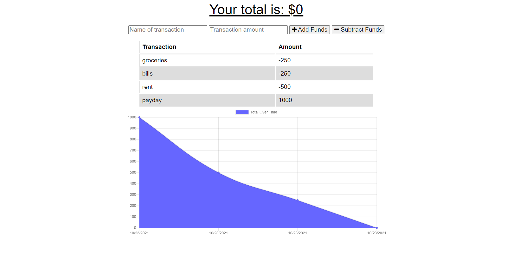

# Online-Offline-Budget-Tracker
         
## Description
A budget tracker application that allows for offline access and functionality. The user is able to add expenses and deposits to their budget with or without a connection. When entering transactions offline, the total is updated when brought back online.   

## Table of Contents
* [Installation](#installation)
* [Usage](#usage)
* [Screenshots](#screenshots)
* [Link to Deployed App](#link)
* [License](#license)
* [Questions](#questions)
            
## Installation
To use the app in your local machine, enter "npm i" in the command-line in order to install necessary npm packages. Enter "npm start" or "node server.js" on the command-line then enter "localhost:3000" on the address bar of the web browser of your choice.
            
## Usage
Enter the name and amount of the transaction you want to enter then select whether it's an addition or subtraction to your funds.

## Screenshots

## Link
https://budget-tracker--web-app.herokuapp.com/
            
## License
Licensed under The MIT License
            
                 
## Questions
Github: https://github.com/ronarceo

Email: ronaldmarceo@gmail.com